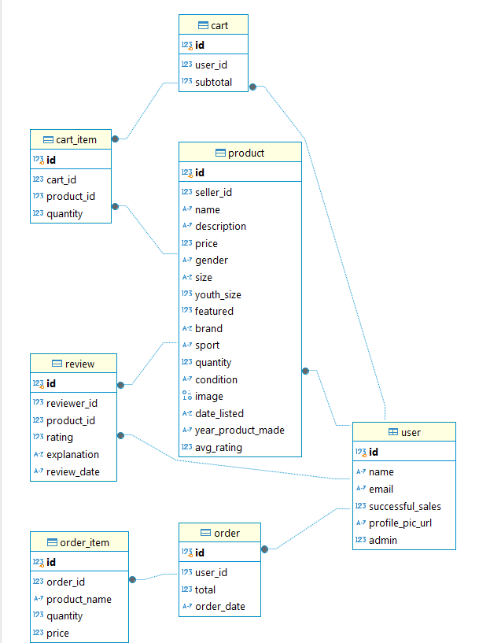

# Advanced Web Dev Final Project
# Group Information

- **Anthony Liscio (100787902)**
- **Mohammad (100755461)**

## Instructions:
- To run locally:
  - Open 2 terminals (windows command line)
    - In 1 terminal:
      - Create virtual environment:
        - `python -m venv .venv`
      - Run virtual environment:
        - `.venv\Scripts\activate`
      - Install dependencies:
        - `cd backend`
        - `pip install -r requirements.txt`
      - Add the necessary .env and client_secret.json files
      - Run backend:
        - `python src/app.py`
    - In the other terminal, run the frontend:
      - `cd frontend`
      - `npm install` (if you haven't run the frontend yet)
      - `npm start`

- To run on docker (not final because of problems with doing requests):
  - `docker-compose up --build`
  - then go to `http://localhost:3000`

## Database Diagram

